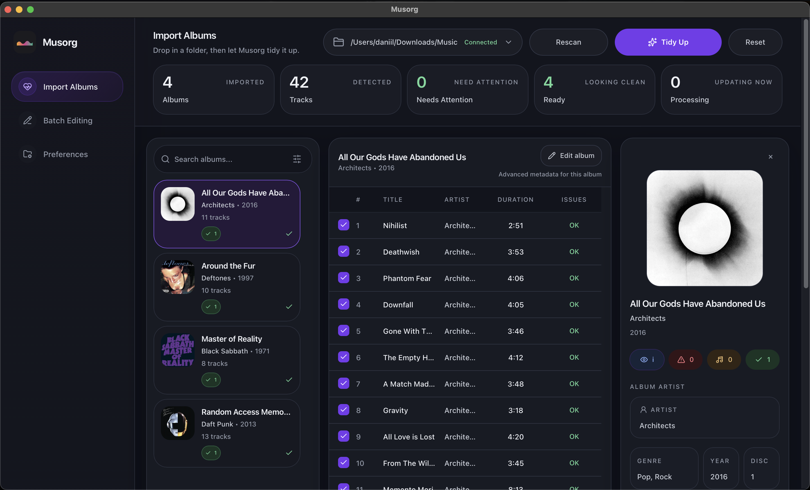
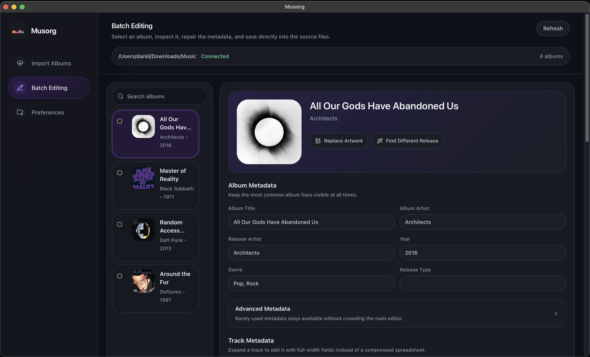
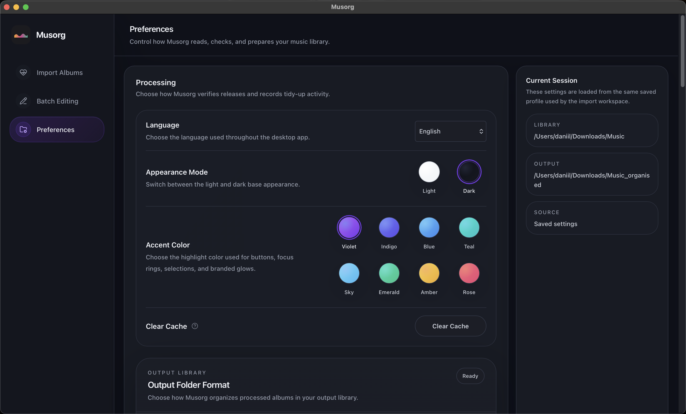
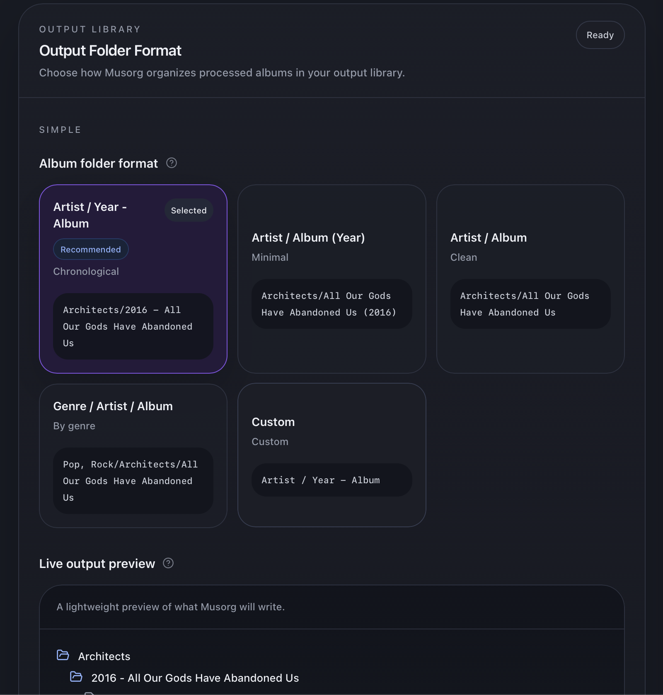
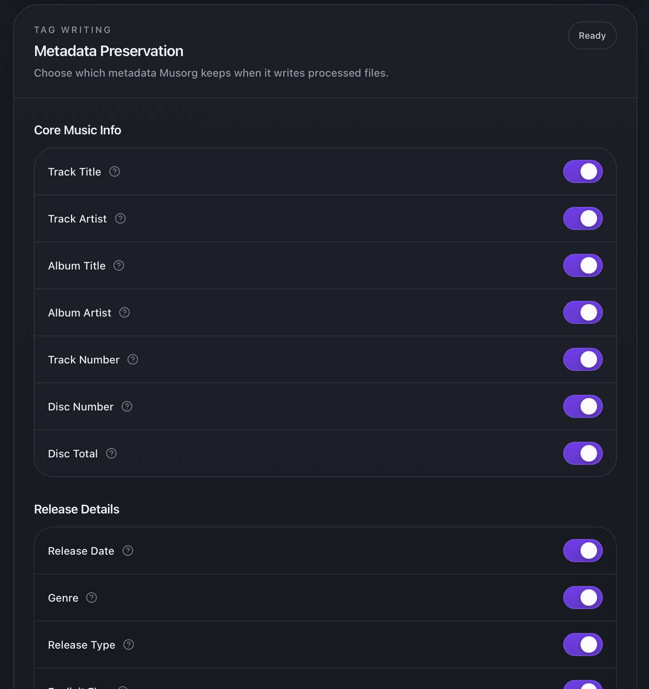
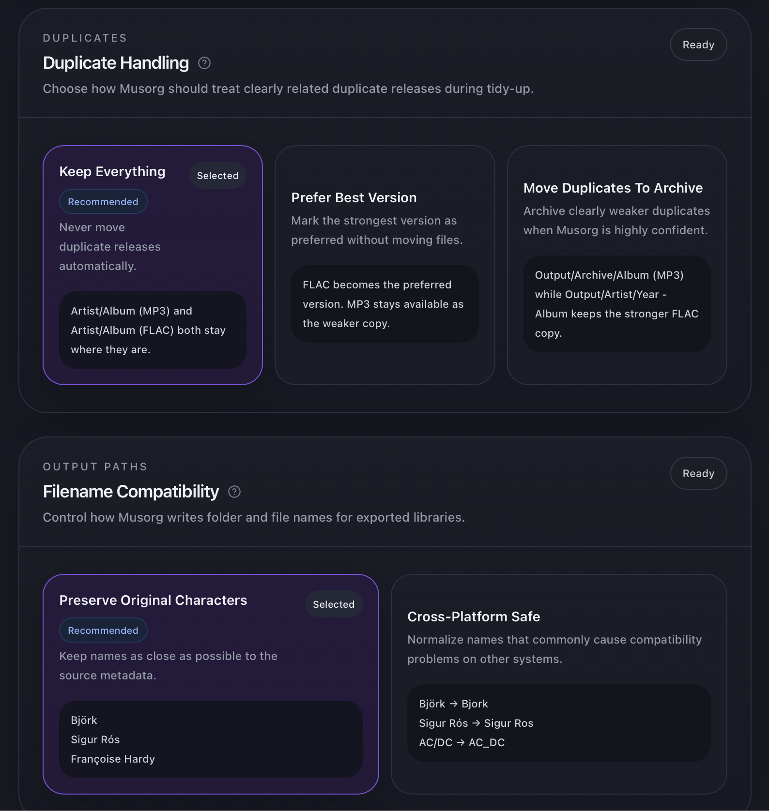
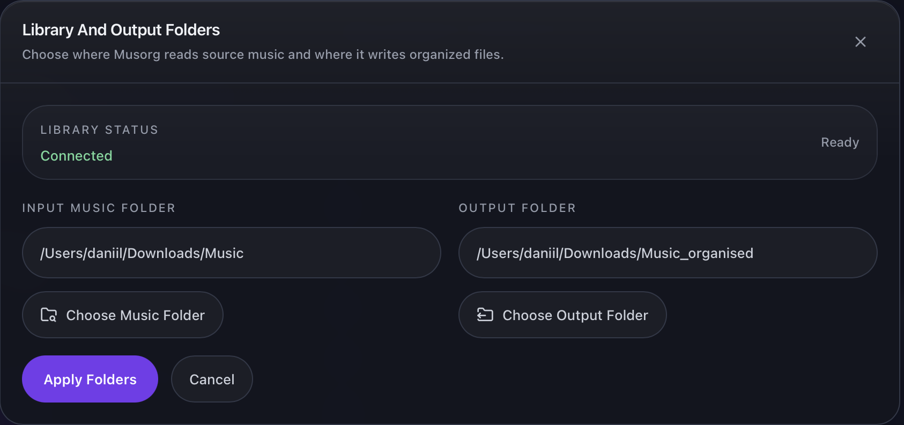

# musorg

**English** | [Русский](README.ru.md)

[](https://github.com/Matrixdan4444/musorg/actions/workflows/ci.yml)

Desktop app for organizing a music library. It scans your folders, matches each
album against online databases, cleans up the metadata, and lays the files out
into a consistent `Artist/Album` structure.


## Features

- **Automatic metadata matching** — looks each album up on Deezer first, then
  falls back to MusicBrainz when Deezer has no confident match.
- **Metadata cleanup** — normalizes artist/album/track fields and fills in
  missing release dates from the matched release.
- **Library organization** — moves tracks into a tidy `Artist/Album` layout and
  fetches cover art.
- **Batch editing** — edit metadata across many tracks at once.
- **Library health checks** — flags albums with missing covers, unknown artists,
  missing track numbers, or inconsistent album artists.

## Screenshots

| | |
|---|---|
| Import & organize |  |
| Batch editing |  |
| Settings |  |
| Output folder format |  |
| Metadata preservation |  |
| Duplicate handling |  |
| Library & output folders |  |

## Download (macOS)

Download the latest `Musorg-*.dmg` from the
[Releases](https://github.com/Matrixdan4444/musorg/releases) page, open it, and
drag **Musorg** into **Applications**.

The app is **not signed with an Apple Developer ID**, so on first launch macOS
Gatekeeper will block it — warning that Apple "could not verify" the app, that
it's from an "unidentified developer," or that it "is damaged and can't be
opened." This is expected for an open-source app distributed without a paid
Apple certificate. To run it the first time, do **one** of the following:

- **System Settings → Privacy & Security** (recommended on macOS Sequoia and
  later). Try to open `Musorg.app` once and dismiss the warning. Then open
  **System Settings → Privacy & Security**, scroll to the **Security** section,
  and next to *"Musorg" was blocked to protect your Mac* click **Open Anyway**.
  Confirm with **Open Anyway** in the dialog that follows. macOS remembers the
  choice afterwards.

- **Right-click** (or Control-click) `Musorg.app` in Applications, choose
  **Open**, then **Open** in the dialog. (On older macOS; on Sequoia use the
  Privacy & Security method above.)

- Or remove the quarantine flag from Terminal, then open the app normally:

  ```bash
  xattr -dr com.apple.quarantine /Applications/Musorg.app
  ```

> Transcoding non-FLAC source files needs [`ffmpeg`](https://ffmpeg.org) on your
> `PATH` (`brew install ffmpeg`). FLAC-only libraries don't need it; cover-art
> resizing uses `sips`, which is built into macOS.

## Architecture

One supported desktop runtime:

- React frontend in `frontend/`
- FastAPI transport layer in `musorg/api/`
- shared backend-safe logic in `musorg/core/`
- pywebview desktop shell in `musorg/desktop_webview/`

All processing flows through a single pipeline: **scan → read metadata → group
by album → organize**. See [`docs/architecture.md`](docs/architecture.md) for
details.

## Build from source

For development, or to run without the prebuilt `.dmg`. Requires Python 3.12+
and Node.js.

**Backend:**

```bash
python -m venv venv
source venv/bin/activate
pip install -r requirements-desktop.txt
```

**Frontend** (the desktop shell serves the built assets, so this step is
required before running):

```bash
cd frontend
npm install
npm run build
```

## Run

```bash
python -m musorg.desktop_webview
```

## Package the macOS app

Build `Musorg.app` and a drag-to-install `.dmg` (after the frontend build
above). Bundling a static ffmpeg is optional — `packaging/fetch_ffmpeg.sh`
fetches and checksum-verifies it; skip it for a FLAC-only build.

```bash
pip install pyinstaller dmgbuild
packaging/fetch_ffmpeg.sh        # optional: bundle a static ffmpeg
pyinstaller Musorg.spec          # -> dist/Musorg.app
packaging/make_dmg.sh            # -> dist/Musorg-<version>.dmg
```

`make_dmg.sh` lays out the installer window with two large icons (Musorg.app
and an Applications symlink) headlessly via `dmgbuild`, so it works in CI.

## Development

Install dev dependencies and run the test suite:

```bash
pip install -r requirements-dev.txt
python -m pytest
```

## License

[MIT](LICENSE)
