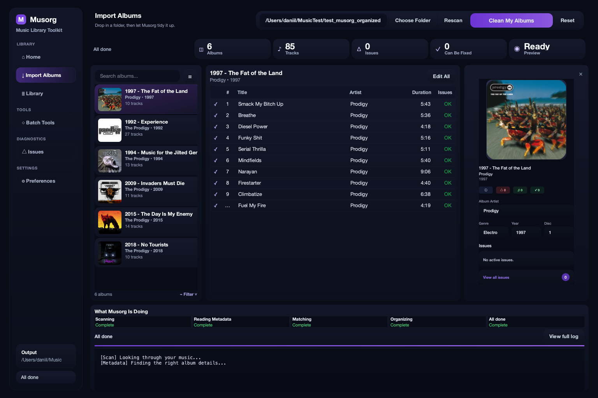
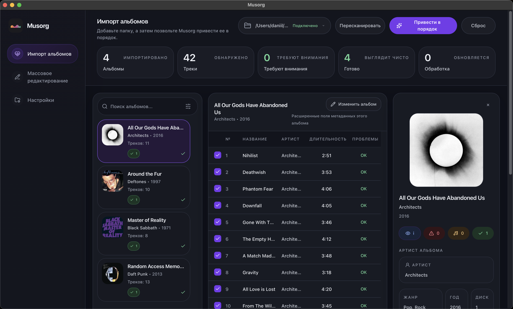
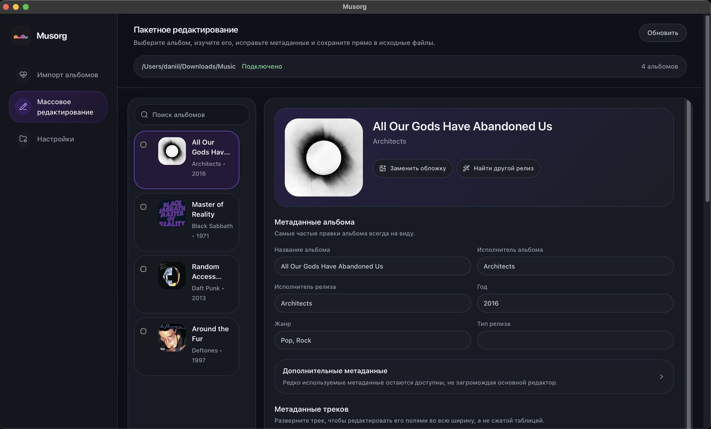
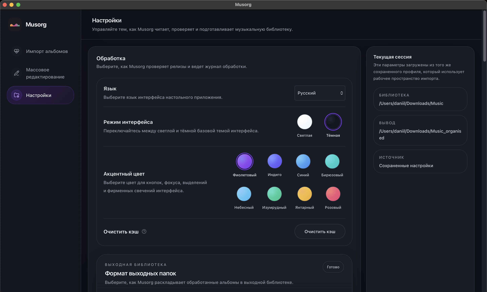
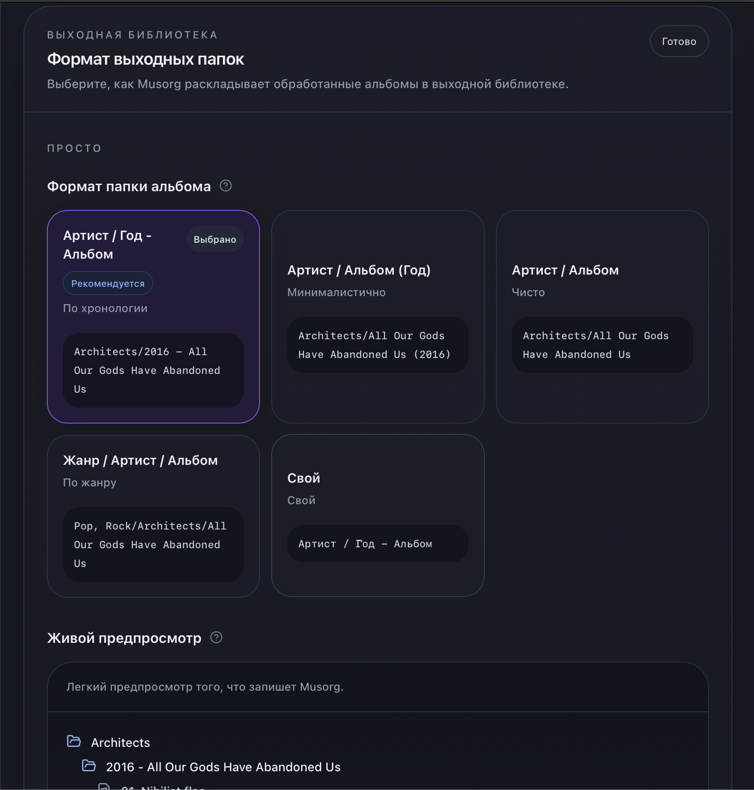
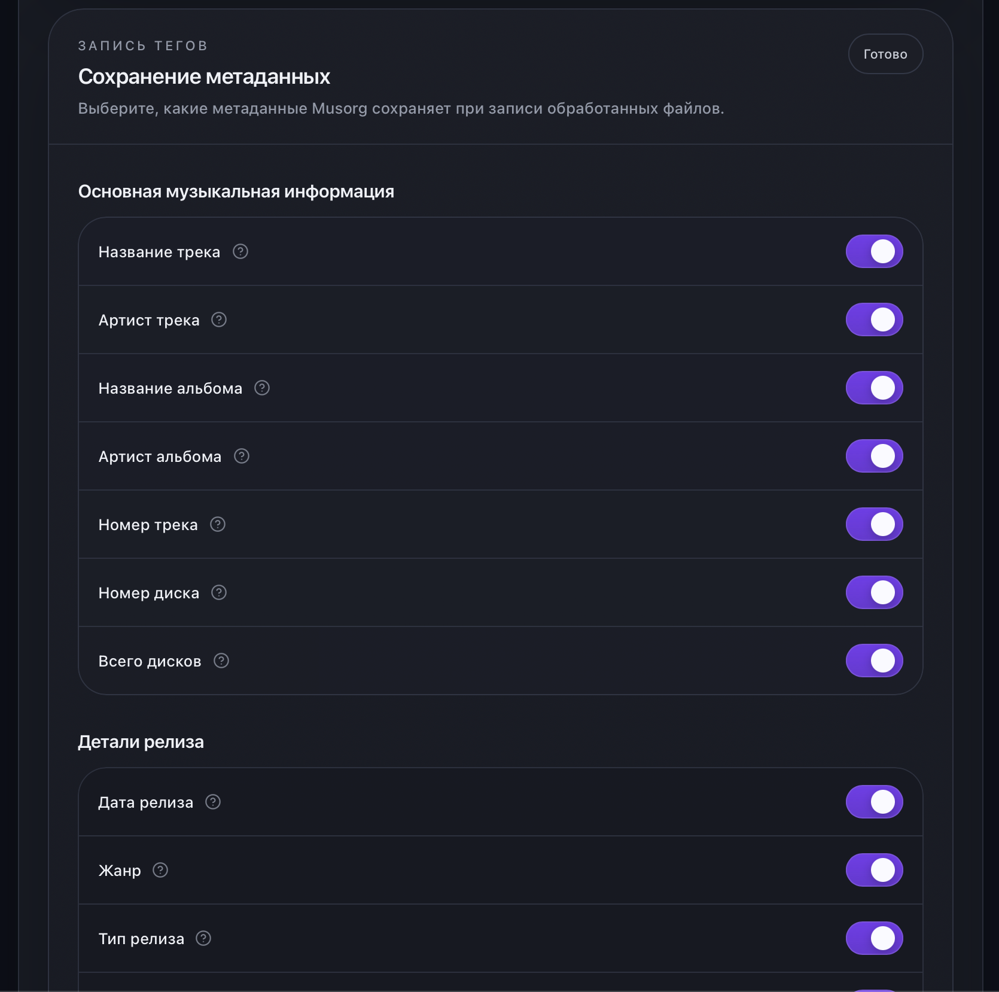
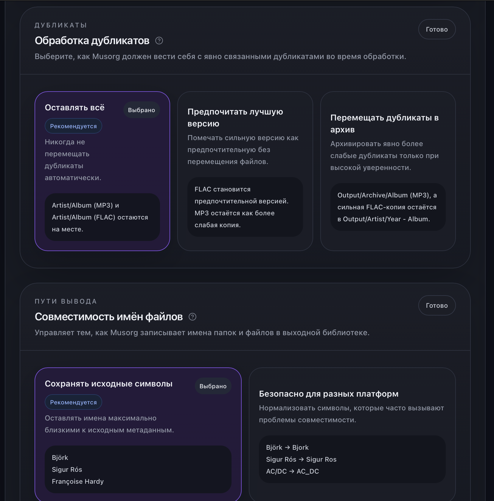
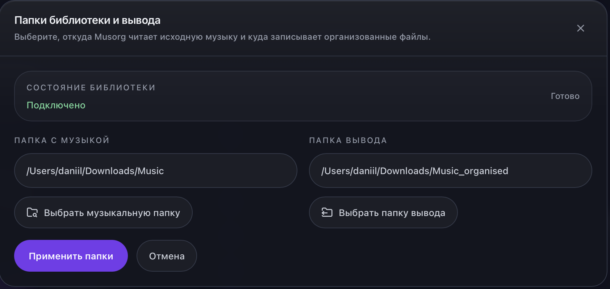

# musorg

[English](README.md) | **Русский**

[](https://github.com/Matrixdan4444/musorg/actions/workflows/ci.yml)

Десктопное приложение для наведения порядка в музыкальной библиотеке. Оно
сканирует ваши папки, сопоставляет каждый альбом с онлайн-базами, приводит в
порядок метаданные и раскладывает файлы в единую структуру `Исполнитель/Альбом`.



## Возможности

- **Автоматическое сопоставление метаданных** — сначала ищет альбом в Deezer, а
  если уверенного совпадения нет, переходит к MusicBrainz.
- **Чистка метаданных** — нормализует поля исполнителя/альбома/трека и
  проставляет недостающие даты релиза из найденного издания.
- **Организация библиотеки** — перемещает треки в аккуратную структуру
  `Исполнитель/Альбом` и подгружает обложки.
- **Пакетное редактирование** — правка метаданных сразу для множества треков.
- **Проверка состояния библиотеки** — отмечает альбомы без обложек, с неизвестными
  исполнителями, без номеров треков или с несогласованным альбомным исполнителем.

## Скриншоты

| | |
|---|---|
| Импорт и организация |  |
| Пакетное редактирование |  |
| Настройки |  |
| Формат папки альбома |  |
| Сохранение метаданных |  |
| Обработка дубликатов |  |
| Папки библиотеки и вывода |  |

## Загрузка (macOS)

Скачайте последний `Musorg-*.dmg` со страницы
[Releases](https://github.com/Matrixdan4444/musorg/releases), откройте его и
перетащите **Musorg** в **Applications**.

Приложение **не подписано Apple Developer ID**, поэтому при первом запуске
Gatekeeper заблокирует его — с предупреждением, что Apple «не удалось
подтвердить» приложение, что оно «от неустановленного разработчика» или что оно
«повреждено и не может быть открыто». Это нормально для приложения с открытым
исходным кодом, распространяемого без платного сертификата Apple. Чтобы запустить
его в первый раз, сделайте **одно** из следующего:

- **Системные настройки → Конфиденциальность и безопасность** (рекомендуется на
  macOS Sequoia и новее). Попробуйте один раз открыть `Musorg.app` и закройте
  предупреждение. Затем откройте **Системные настройки → Конфиденциальность и
  безопасность**, прокрутите до раздела **Безопасность** и рядом с
  *«Файл „Musorg“ заблокирован для защиты Вашего Mac»* нажмите **Все равно
  открыть**. Подтвердите **Все равно открыть** в появившемся диалоге. macOS
  запомнит выбор.

- **Правый клик** (или Control-клик) по `Musorg.app` в Applications, выберите
  **Открыть**, затем **Открыть** в диалоге. (На старых версиях macOS; на Sequoia
  используйте способ через «Конфиденциальность и безопасность» выше.)

- Либо снимите флаг карантина в Терминале и откройте приложение обычным способом:

  ```bash
  xattr -dr com.apple.quarantine /Applications/Musorg.app
  ```

> Для перекодирования не-FLAC исходников нужен [`ffmpeg`](https://ffmpeg.org) в
> `PATH` (`brew install ffmpeg`). Для библиотек только из FLAC он не требуется;
> для изменения размера обложек используется `sips`, встроенный в macOS.

## Архитектура

Один поддерживаемый десктопный рантайм:

- React-фронтенд в `frontend/`
- транспортный слой FastAPI в `musorg/api/`
- общая backend-безопасная логика в `musorg/core/`
- десктопная оболочка pywebview в `musorg/desktop_webview/`

Вся обработка проходит через единый конвейер: **сканирование → чтение метаданных →
группировка по альбомам → организация**. Подробности — в
[`docs/architecture.md`](docs/architecture.md).

## Сборка из исходников

Для разработки или запуска без готового `.dmg`. Требуется Python 3.12+ и Node.js.

**Бэкенд:**

```bash
python -m venv venv
source venv/bin/activate
pip install -r requirements-desktop.txt
```

**Фронтенд** (десктопная оболочка отдаёт собранные ассеты, поэтому этот шаг
обязателен перед запуском):

```bash
cd frontend
npm install
npm run build
```

## Запуск

```bash
python -m musorg.desktop_webview
```

## Упаковка приложения для macOS

Соберите `Musorg.app` и `.dmg` для установки перетаскиванием (после сборки
фронтенда выше). Встраивание статического ffmpeg опционально —
`packaging/fetch_ffmpeg.sh` скачивает его и проверяет контрольную сумму; для
сборки только под FLAC этот шаг можно пропустить.

```bash
pip install pyinstaller dmgbuild
packaging/fetch_ffmpeg.sh        # опционально: встроить статический ffmpeg
pyinstaller Musorg.spec          # -> dist/Musorg.app
packaging/make_dmg.sh            # -> dist/Musorg-<версия>.dmg
```

`make_dmg.sh` оформляет окно установщика с двумя большими иконками (Musorg.app и
симлинк на Applications) headless через `dmgbuild`, поэтому работает и в CI.

## Разработка

Установите dev-зависимости и запустите тесты:

```bash
pip install -r requirements-dev.txt
python -m pytest
```

## Лицензия

[MIT](LICENSE)
